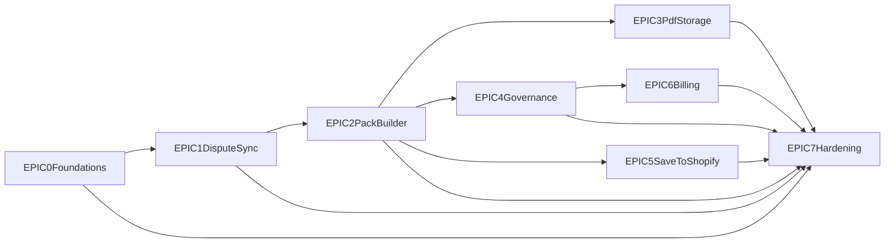

# DisputeDesk V1 Roadmap

> **Last updated:** 2026-02-24

## Progress

| Epic | Name | Status | Week | Doc |
|------|------|--------|------|-----|
| 0 | Foundations | DONE | 1 | [EPIC-0](epics/EPIC-0-foundations.md) |
| 1 | Dispute Sync | Pending | 1-2 | [EPIC-1](epics/EPIC-1-dispute-sync.md) |
| 2 | Evidence Pack Builder | Pending | 2-3 | [EPIC-2](epics/EPIC-2-evidence-pack-builder.md) |
| 3 | PDF Rendering & Storage | Pending | 3 | [EPIC-3](epics/EPIC-3-pdf-rendering.md) |
| 4 | Governance & Review Queue | Pending | 3-4 | [EPIC-4](epics/EPIC-4-governance.md) |
| 5 | Save Evidence to Shopify | Pending | 4 | [EPIC-5](epics/EPIC-5-save-to-shopify.md) |
| 6 | Billing & Plan Limits | Pending | 5 | [EPIC-6](epics/EPIC-6-billing.md) |
| 7 | Hardening | Pending | 5-6 | [EPIC-7](epics/EPIC-7-hardening.md) |

## Dependency Chain

